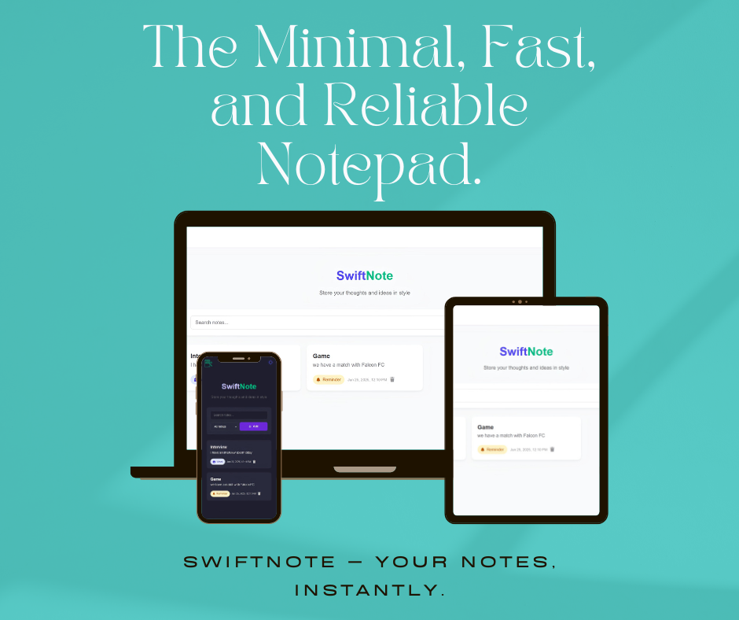

# 📝 SwiftNotes

SwiftNotes is a sleek and responsive web-based notepad application designed to help you quickly capture, organize, and manage your thoughts, tasks, and ideas. Built with vanilla JavaScript and local storage.

## 🔍 Features

- 📄 Create, edit, and delete notes
- 🔎 Real-time search
- 🏷️ Tag-based filtering (Work, Personal, Ideas, Reminders)
- 🧠 LocalStorage support (your data is saved even after refreshing)
- 🎨 Clean and modern UI/UX
- 📱 Fully responsive layout
- 🔐 Confirmation modal before deleting a note

## 🚀 Demo

  

<i>

  
